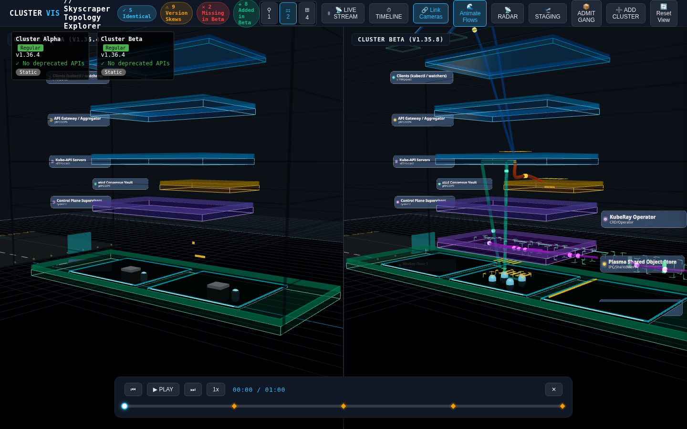

# Cluster Visualizer (`cluster-vis`)

[](LICENSE)
[](https://kubernetes.io)
[](https://threejs.org/)
[](https://www.typescriptlang.org/)
[](https://vite.dev/)
[](https://helm.sh/)

**Cluster Visualizer** (`cluster-vis`) is an interactive 3D Kubernetes cluster comparison, architectural topology, and real-time data-flow visualization engine. Built with Three.js, TypeScript, and Python, it renders multi-cluster topologies in interactive 3D space, highlights semantic version skews down to container image SHA256 digests, visualizes distributed compute frameworks (Ray, Spark) and stateful databases (PostgreSQL HA, Redis), and streams live cluster state changes via lightweight in-cluster operators.

---

## UI Overview

Below is a live rendering of Cluster Visualizer performing a side-by-side comparison between **Cluster Alpha (v1.36.4)** and **Cluster Beta (v1.35.8)**:



### Key UI Capabilities
- **Dual & Quad Viewport Split-Screen:** Compare clusters side-by-side (`⚏ 2`) or monitor 4-cluster fleet matrices (`⊞ 4`) simultaneously.
- **Interactive UI Cluster Onboarding (`➕ ADD CLUSTER`):** Modal dialog supporting copyable Helm installation commands, `TokenReview` bearer authentication (stored in `sessionStorage`), client-side direct Kubernetes API extraction with zero cluster footprint, and instant sample loading.
- **Autoscaling Traffic Simulation Test Harness (`⚡ TRAFFIC HARNESS` / `KeyT`):** Dockable bottom HUD running discrete-event $M/M/c/K$ queuing physics, testing real-time autoscaling, conduit flow speed/color modulation, and comparative auto-provisioning latency (GKE Autopilot Compute Class vs Karpenter / Static NodePools).
- **Synchronized Camera Navigation:** `🔗 Link Cameras` locks OrbitControls pitch, yaw, and zoom across viewports for synchronized multi-angle architectural reviews.
- **Visual Git-Style Diff Badges:** Real-time summary counters in the top HUD highlight `Identical` components, `Version Skews`, `Missing` workloads, and `Added` resources.
- **Layered 3D Elevation:** Clear vertical stratification separating External Ingress, API Gateways, Control Plane Supervisors, Worker Node Decks, and Subterranean Cloud Vaults.
- **Dynamic Conduit Flows:** Animated Bezier curves with flowing particles visualising inter-service traffic and database replication streams.
- **Time-Travel Scrubber HUD:** Interactive bottom dock for keyframe scrubbing, historical playback, and temporal delta inspection.

---

## Core Features

- **Semantic Version & Digest Diffing:** Compares Kubernetes resource graphs, detecting API deprecations, container image tag drift, and silent SHA256 image digest discrepancies.
- **Instant Simulated Sample Catalog (<100ms Hydration):** Pre-packaged reference topologies bundled with the client: Vanilla OSS v1.36.4, 11-microservice Google Online Boutique with Redis cart and Sub-Level B2 vaults, KubeRay AI cluster with GPU accelerator bays and Kueue staging pallets, and GKE Compute Class vs Karpenter auto-provisioning benchmark.
- **Client-Side Direct Kubernetes API Extractor:** In-browser manifest parser (`src/ingestion/client_extractor.ts`) transforming raw Kubernetes API responses (`/api/v1/pods`, `/nodes`, `/services`, `/apis/autoscaling/v2/horizontalpodautoscalers`) directly into 3D Skyscraper topology graphs without server-side agents.
- **Comparative Scheduling Latency Benchmark:** Real-time side-by-side demonstration contrasting sub-second scheduling and in-place VPA morphing on pre-warmed compute slices against cold VM provisioning delays in traditional or Karpenter clusters where pending pods accumulate in the exterior staging yard.
- **Dual Layout Engines:**
  - **Skyscraper Architecture Mode:** Hierarchical spatial elevation separating control plane components, worker trays, and subterranean storage.
  - **Latency Force Field Mode:** Force-directed spring-mass topology where 3D spatial distances between nodes reflect physical network latency.
- **Distributed Framework Detection:** Specialized visualizers for KubeRay clusters (Head, Workers, Plasma store), Apache Spark, PostgreSQL HA clusters with Patroni leader-follower replication, and Redis clusters.
- **Subterranean Foundation Strata:** Visualizes cloud-managed resources (GCP KCC, kro resource graphs, CloudSQL, Pub/Sub, Redis) anchored beneath worker decks with plunge latency conduits.
- **Autoscaling & Kueue Staging:** Proportional pod capsule sizing, in-place VPA morphing animations, HPA lateral conveyor replication, and external Kueue gang-scheduling staging yards.
- **Zero-Trust Secret Scrubbing:** Automatic in-memory token, certificate, and secret redaction (`sha256:` fingerprinting) before data leaves the cluster boundary.

---

## Quickstart (Local Web UI)

### Prerequisites
- Node.js 18+ and npm
- Python 3.10+ (for ingestion and diff CLI tools)

### 1. Install & Launch Frontend
```bash
git clone https://github.com/jagosan/cluster-vis.git
cd cluster-vis
npm install
npm run dev
```
Open **`http://localhost:5173/`** in your browser. The UI immediately loads pre-packaged sample clusters in dual split-screen mode.

### 2. Exploring Built-in Sample Clusters
Click **`➕ ADD CLUSTER`** or explore the built-in catalog fixtures:
- `sample-ray-kuberay.json`: Distributed Ray AI training cluster with head/worker nodes, GPU accelerator bays, and Kueue gang pallets.
- `sample-online-boutique.json`: 11-tier microservice architecture with Redis cart, HPA, and Sub-Level B2 cloud vaults.
- `sample-upstream-k8s.json`: Upstream Kubernetes 1.36 control plane baseline with CoreDNS, kube-proxy, and CNI.
- `sample-compute-class-bench.json`: GKE Autopilot Compute Class vs. Karpenter and traditional node pool benchmark.

### 3. Simulating Traffic & Autoscaling Spikes (`KeyT`)
1. Press **`KeyT`** or click **`⚡ TRAFFIC HARNESS`** in the topbar to dock the traffic control deck.
2. Select target workload (e.g. `frontend`), pattern (`Step Spike`), and load (e.g. `850 RPS`).
3. Click **`▶ INJECT TRAFFIC`** or **`⚡ BURST 2000 RPS`**:
   - In **GKE Autopilot Compute Class** mode, pods schedule onto pre-warmed slices in seconds ($\tau_{\text{sched}} \approx 3.5\text{s}$) with 0% error rate and transient peak latency $\le 48\text{ms}$.
   - In **Karpenter / Static NodePool** mode, observe cold VM provisioning delays ($\tau_{\text{node}} \approx 60 - 150\text{s}$) where pending pods hover in the **Exterior Staging Yard ($X < -12.0$)** with amber tractor beams, and queuing latency spikes past $700\text{ms}$.
   - Flow conduit particles dynamically scale speed and modulate color from cyan ($<30\text{ms}$) to amber ($30-200\text{ms}$) to blazing crimson ($>200\text{ms}$).

---

## How to Deploy to Arbitrary Clusters

You can deploy Cluster Visualizer's lightweight topology operator and synthetic probe to any arbitrary Kubernetes cluster (local Kind/K3s/k3d, on-premises bare metal, or cloud EKS/GKE/AKS).

### Method 1: Deploy via Helm (Recommended)

The Helm chart in `charts/clustervis` deploys the in-cluster operator, RBAC rules, and optional unprivileged TCP probe DaemonSet.

```bash
# 1. Add context and namespace
kubectl config use-context <your-cluster-context>
kubectl create namespace clustervis-system

# 2. Install the Helm chart
helm upgrade --install clustervis ./charts/clustervis \
  --namespace clustervis-system \
  --set operator.config.defaultLayoutMode="skyscraper" \
  --set telemetry.mode="probe" \
  --set probe.enabled=true

# 3. Verify operator deployment
kubectl get pods -n clustervis-system
```

#### Exposing and Connecting to the Operator
Port-forward the operator's HTTP / Server-Sent Events (SSE) server:
```bash
kubectl port-forward -n clustervis-system svc/clustervis 8080:8080
```
The operator serves:
- `GET /healthz`: Health and readiness check.
- `GET /snapshot`: Single-shot snapshot of the current sanitized cluster topology graph.
- `GET /api/v1/topology/stream`: Continuous SSE stream publishing real-time pod/node/CRD mutations.

### Method 2: Direct Kubernetes Manifests

If you prefer applying raw YAML without Helm:
```bash
# Apply CustomResourceDefinition
kubectl apply -f deploy/crd/clustervis.io_clustertopologysnapshots.yaml

# Apply Operator ServiceAccount, RBAC, and Deployment
kubectl apply -f deploy/operator/operator.yaml
```

### Method 3: In-Browser Live Connect (Interactive UI)

1. In the Web UI, click the **`➕ ADD CLUSTER`** button in the top navigation bar.
2. Select **Live Stream (SSE)** or **TokenReview Auth**.
3. Input your streaming endpoint (e.g. `http://localhost:8080/api/v1/topology/stream` or your Ingress URL) and cluster identifier.
4. Select the viewport target (`Alpha (Left)` or `Beta (Right)`) and click **Connect**.

### Method 4: Zero-Install Offline Exporter (CLI)

For air-gapped environments or one-off architectural dumps, use the zero-dependency CLI exporter. It queries the cluster via `kubectl`, enriches frameworks, applies spatial positioning, sanitizes all secrets, and writes a standalone JSON graph:

```bash
# Export from current context
./bin/cluster-vis dump -o public/data/my-cluster.json

# Export from a specific kubeconfig and context
./bin/cluster-vis dump \
  --kubeconfig ~/.kube/config \
  --context production-cluster-us-west \
  --output public/data/prod-west.json
```

---

## How to Compare 2 Clusters

Cluster Visualizer makes it effortless to detect architectural drift, configuration discrepancies, and version regressions between any two clusters (e.g., Staging vs. Production, or pre-upgrade vs. post-upgrade).

### Step 1: Export Topology Graphs for Both Clusters

Run the exporter against both clusters:
```bash
# Export Cluster A (e.g., Staging or Alpha)
./bin/cluster-vis dump --context cluster-alpha -o public/data/cluster-alpha.json

# Export Cluster B (e.g., Production or Beta)
./bin/cluster-vis dump --context cluster-beta -o public/data/cluster-beta.json
```

### Step 2: Compute the Semantic Diff Report (CLI)

Use the built-in diff engine to generate a detailed JSON report highlighting identical nodes, version skews, image tag drifts, digest discrepancies, and missing/added workloads:

```bash
# Compute diff and save to JSON
./bin/cluster-vis diff public/data/cluster-alpha.json public/data/cluster-beta.json -o public/data/cluster-diff.json
```

Example CLI Output:
```text
✅ Diff written to public/data/cluster-diff.json
   Identical: 5 | Skews: 9 | Missing in Target: 2 | Added: 8
```

You can also run the full end-to-end ingestion and diff pipeline in one command using environment variables:
```bash
CLUSTER_A_CONTEXT="staging" CLUSTER_B_CONTEXT="production" ./bin/cluster-vis
```

### Step 3: Launch Side-by-Side 3D Visual Comparison

1. Start or refresh the visualizer:
   ```bash
   npm run dev
   ```
2. Navigate to `http://localhost:5173/`.
3. In the top bar, ensure Split View (`⚏ 2`) is active.
4. The left viewport displays **Cluster Alpha** and the right viewport displays **Cluster Beta**.
5. Enable **`🔗 Link Cameras`** to pan, rotate, and zoom both clusters simultaneously.

### Step 4: Inspecting Drifts & Divergences in 3D
- **Color Codes:**
  - 🟦 **Cyan / Neutral:** Identical versions and image digests.
  - 🟨 **Amber Halo:** Semantic version skew, image tag drift, or SHA256 digest mismatch.
  - 🟥 **Crimson Wireframe:** Workload present in Cluster A but missing in Cluster B.
  - 🟩 **Emerald Glow:** Workload newly added in Cluster B.
- **Diff Cards:** Click any component with an amber halo in the 3D scene to open a floating 3D billboarding diff card displaying the exact drift details (e.g. `v1.36.4` vs `v1.35.8` or image digest hashes).
- **Diff Inspector Drawer:** Slide open the comparison drawer to filter by namespace and review tabular comparison details.

---

## CLI Reference

`cluster-vis` provides a unified dispatcher CLI located at `bin/cluster-vis`:

| Command | Description | Example |
| :--- | :--- | :--- |
| `cluster-vis dump` | Export cluster topology to JSON | `./bin/cluster-vis dump --context prod -o prod.json` |
| `cluster-vis diff` | Compare two cluster JSON topologies | `./bin/cluster-vis diff alpha.json beta.json -o diff.json` |
| `cluster-vis record` | Record time-travel delta stream | `./bin/cluster-vis record --interval 5 --duration 60` |
| `cluster-vis testbed` | Ephemeral K3d multi-cluster lifecycle | `./bin/cluster-vis testbed up --spec testbeds/fleet-spec.yaml` |

---

## Specifications & Architecture

Every capability in Cluster Visualizer is engineered according to formal architectural specifications:

<!-- SPECS_TABLE_START -->
| Spec ID & Path | Title & Focus Area | Status |
| :--- | :--- | :---: |
| [`specs/00-system-architecture.md`](specs/00-system-architecture.md) | **Cluster Visualizer (Kubernetes 3D Comparison & Dependency Engine)** | `Implemented` |
| [`specs/01-architectural-skyscraper-topology.md`](specs/01-architectural-skyscraper-topology.md) | **Architectural Skyscraper Topology & Procedural Conduit Stack** | `Implemented` |
| [`specs/02-layered-rectangular-architecture.md`](specs/02-layered-rectangular-architecture.md) | **3D Layered Rectangular Architectural Visualizer (Transformer/DeepSeek Reference)** | `Implemented` |
| [`specs/03-horizontal-node-peers-and-diff-engine.md`](specs/03-horizontal-node-peers-and-diff-engine.md) | **Horizontal Node Peers, 3D Graph Diff Engine & Universal Cluster Exporter** | `Implemented` |
| [`specs/04-in-cluster-streaming-operator.md`](specs/04-in-cluster-streaming-operator.md) | **Optional In-Cluster Streaming Topology Operator & CRD (`clustervis.io/v1alpha1`)** | `Implemented` |
| [`specs/05-time-travel-topology-scrubber.md`](specs/05-time-travel-topology-scrubber.md) | **Time-Travel Cluster Topology Playback & Historical Scrubber Engine** | `Implemented` |
| [`specs/06-ephemeral-multi-cluster-testbed-and-live-streaming.md`](specs/06-ephemeral-multi-cluster-testbed-and-live-streaming.md) | **Ephemeral Multi-Cluster Testbed & Live Streaming Topology Matrix** | `Implemented` |
| [`specs/07-portable-helm-packaging-and-latency-topology.md`](specs/07-portable-helm-packaging-and-latency-topology.md) | **Portable In-Cluster Helm Packaging, Latency-Distance Topology & Federated Security** | `Implemented` |
| [`specs/08-subterranean-dependencies-and-compute-classes.md`](specs/08-subterranean-dependencies-and-compute-classes.md) | **Subterranean Strata — Hardware Shapes, Karpenter Compute Classes & Managed Cloud Vaults (GCP KCC & kro)** | `Implemented` |
| [`specs/09-pod-autoscaling-morphing-and-kueue-staging.md`](specs/09-pod-autoscaling-morphing-and-kueue-staging.md) | **Workload Lifecycle — Proportional Pod Sizing, VPA/HPA Morphing & The Pre-Admission Staging Yard (Kueue Gang Scheduling)** | `Implemented` |
| [`specs/10-interactive-ui-cluster-onboarding-sample-catalog-and-autoscaling-traffic-harness.md`](specs/10-interactive-ui-cluster-onboarding-sample-catalog-and-autoscaling-traffic-harness.md) | **Interactive UI Cluster Onboarding, Simulated Sample Catalog & Autoscaling Traffic Simulation Harness** | `Implemented` |
<!-- SPECS_TABLE_END -->

- **Symbol & File Map:** [`docs/MAP.md`](docs/MAP.md) provides a comprehensive map of all modules, source files, and architectural relationships.

---

## Continuous README Refinement & Git Hooks Workflow

To guarantee that documentation never rots as the project evolves, this repository features an automated README refinement and validation workflow.

### Automated Hook Setup
Run the setup command once to configure Git hooks:
```bash
npm run setup-hooks
# or: bash scripts/install-hooks.sh
```

This configures Git (`core.hooksPath .githooks`) to run automated checks on every commit and push:
- **Pre-Commit Hook (`.githooks/pre-commit`):**
  1. Runs `scripts/refine_readme.py --update` to automatically synchronize the specifications index table, sample catalog entries, and file references.
  2. If updates occur, automatically stages `README.md` into the active commit.
  3. Verifies that all embedded links and media (e.g. `docs/assets/ui-sample.png`) exist on disk.
- **Pre-Push Hook (`.githooks/pre-push`):**
  1. Runs `scripts/refine_readme.py --check` in strict mode to ensure zero broken links, all essential sections are present, and documentation integrity is intact.

### Manual Commands
You can also manually validate or synchronize the README at any time:
```bash
# Auto-update and synchronize specification tables in README.md
npm run refine:readme

# Validate link integrity and completeness without modifying files
npm run check:readme
```

---

## License

This project is licensed under the **Apache License, Version 2.0**. See the [LICENSE](LICENSE) file for the full license text.
