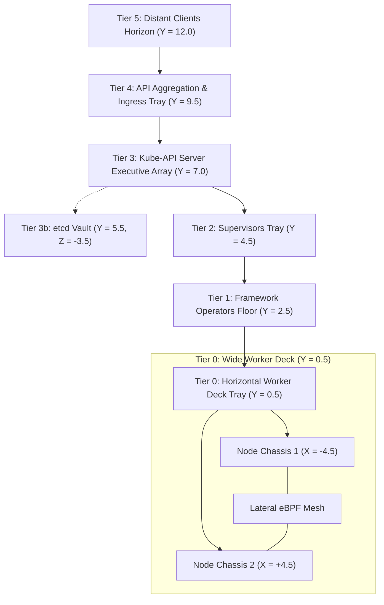
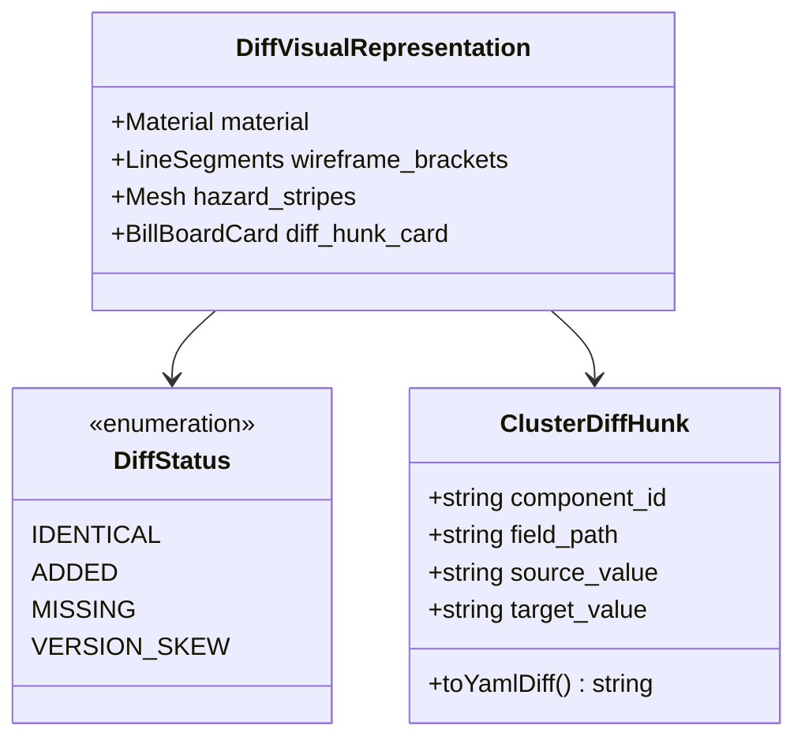

# Architectural Blueprint: SPEC-03 Horizontal Node Peers, 3D Graph Diff Engine & Universal Exporter

**Status:** Approved  
**Author:** 🦉 Owl (Architectural Blueprint & Orchestrator)  
**Target:** `cluster-vis`  
**Reference:** `specs/03-horizontal-node-peers-and-diff-engine.md`  

---

## 1. Executive Summary & Design System

SPEC-03 resolves three core visual and architectural imperatives identified in SPEC-02:
1. **Horizontal Worker Deck ($Y = +0.5$):** Eliminates vertical stacking of same-tier worker nodes. All worker nodes are positioned as lateral peers along the X-axis upon a single wide architectural floor tray. Vertical elevation strictly denotes control hierarchy.
2. **3D Volumetric Git-Diff Engine:** Transforms dot-based diffs into volumetric spatial expressions:
   - **`added` (+):** Vibrant emerald cuboid (`#10b981`), pulsing green corner holographic brackets.
   - **`missing` (-):** Red translucent wireframe "ghost" cage (`#ef4444`, opacity $0.35$).
   - **`version_skew` (~):** Amber/gold metallic housing (`#f59e0b`), pulsing hazard stripe textures, and detailed drift tagging.
   - **3D Billboarding Hunk Cards:** Interactive floating diff cards presenting side-by-side YAML diffs directly anchored to hovered or selected drifted components.
3. **Universal Cluster Exporter (`cluster-vis dump` / `src/ingestion/exporter.py`):**
   - Standalone CLI extracting topology from any live Kubernetes cluster context.
   - Discovers all core and custom resources, scrubs secrets, computes configuration digests, and exports normalized `ClusterGraph` JSON.

---

## 2. Structural Architecture & Floorplan



### 2.1 The Horizontal Worker Deck Spatial Math
Given $N$ worker nodes, the worker floor tray dimensions are:
- $\text{Width} = 10.0 + (N - 1) \times 6.0$
- $\text{Depth} = 6.5$
- $\text{Height} = 0.35$
- $\text{Elevation} = Y = +0.5$

Each node chassis $i \in [0, N-1]$ is centered at:
$$X_i = -\frac{(N - 1) \times 6.0}{2} + i \times 6.0$$
Within each chassis (dimensions $5.2 \times 4.8 \times 0.2$):
- **Runtime Bay (Left):**
  - Kubelet: $(X_i - 1.8, Y = 0.7, Z = -1.5)$
  - Containerd: $(X_i - 0.8, Y = 0.7, Z = -1.5)$
- **DaemonSet Bay (Right):**
  - `kube-proxy`: $(X_i + 1.2, Y = 0.65, Z = -1.5)$
  - `cilium` / CNI: $(X_i + 2.0, Y = 0.65, Z = -1.5)$
  - `node-exporter`: $(X_i + 1.6, Y = 0.65, Z = -0.5)$
- **Workload Pod Bay (Center/Front):**
  - Pod slots arranged along $Z = +0.5, +1.5$, staggered along $X_i \pm 0.8$.

---

## 3. 3D Volumetric Git-Diff Engine Specification



### 3.1 Shader & Visual State Contracts
1. **Identical Components:**
   - Base Slate PBR (`#1e293b`), roughness $0.3$, metalness $0.2$, subtle cyan edge contours (`#0284c7`).
2. **Added Components (`+`):**
   - Base Emerald PBR (`#059669`), emissive `#10b981` (intensity $0.6$).
   - 8 corner holographic bracket line segments pulsing via sine wave: $\text{opacity} = 0.6 + 0.4 \sin(4t)$.
3. **Missing / Deleted Components (`-`):**
   - Translucent wireframe cage (`#ef4444`, opacity $0.30$, depthWrite `false`).
   - Hollow ghost structure preserving spatial footprint.
4. **Modified / Skewed Components (`~`):**
   - Base Gold/Amber PBR (`#d97706`), emissive `#f59e0b` (intensity $0.4$).
   - Diagonal hazard stripe overlay on top face.
   - Interactive click emits `onNodeSelected` triggering floating 3D billboarding HTML diff card.

---

## 4. Universal Cluster Exporter Architecture (`cluster-vis dump`)

### 4.1 CLI Interface Contract
```bash
python3 -m src.ingestion.exporter --kubeconfig ~/.kube/config --context kind-cluster-alpha --output dist/data/cluster-alpha.json
```

### 4.2 Pipeline Stages
1. **Dynamic Resource Discovery:** Uses `client.DiscoveryClient` or dynamic client to list all supported API groups and CRDs (`ray.io`, `sparkoperator.k8s.io`, `postgresql.cnpg.io`).
2. **Secret Scrubbing & Digest Generation:**
   - Keys in `ConfigMap` preserved; values hashed to `sha256:abcd...` to detect drift without secret leaks.
   - Container image digests extracted from `containerStatuses[*].imageID`.
3. **Owner Hierarchy Resolution:** Links pods to ReplicaSets, Deployments, StatefulSets, and DaemonSets.
4. **Topology Normalization:** Produces standard `ClusterGraph` JSON schema.

---

## 5. Architectural Decision Records (ADRs)

### ADR-03: Horizontal Worker Deck vs Vertical Floor Stacking
- **Context:** Stacking worker nodes vertically like floors created false architectural impressions that Worker 2 was "subordinate" or "supervised by" Worker 1.
- **Decision:** Place all worker nodes on a unified wide deck tray at Tier 0 ($Y = 0.5$). Worker nodes expand along the horizontal $X$-axis.
- **Consequences:** Restores architectural purity: vertical height strictly equals control plane privilege. Inter-node lateral mesh (CNI) is rendered intuitively across the horizontal expanse.

### ADR-04: Volumetric Shading & Wireframe Holograms for Semantic Git-Diff
- **Context:** Color dots and badges were insufficient to convey structural architectural absence and additions in 3D space.
- **Decision:** Use volumetric materials: wireframe ghost cages for missing elements, emerald holographic corner brackets for additions, and metallic amber hazard styling for skewed pods.
- **Consequences:** Immediate visual readability of cluster drift from distant orbit cameras.

### ADR-05: Universal Zero-Dependency Exporter CLI
- **Context:** The tool was previously limited to static YAML testbed files.
- **Decision:** Provide `src/ingestion/exporter.py` wrapping standard `kubernetes` Python client with dynamic discovery, scrubbing, and normalization.
- **Consequences:** Any user can run `python3 -m src.ingestion.exporter` against any live production or staging cluster to produce visualizable artifacts.

---

## 6. 💡 Note to Future Self: Hosting Portability

- The 3D diff engine is entirely implemented within the Three.js client (`src/scene/cluster_viewport.ts`), evaluating `diffStatus` and `diffDetails` embedded in static JSON artifacts.
- The `exporter.py` CLI runs completely standalone without any running web services, generating static JSON bundles.
- As a result, the entire visualization platform remains 100% statically hostable (e.g. Cloudflare Pages, GitHub Pages) without any live backend server required.
