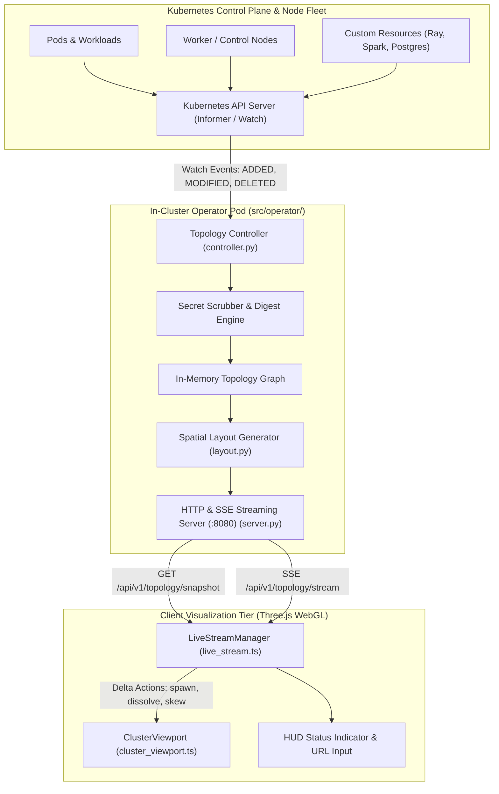

# Architectural Blueprint: SPEC-04 In-Cluster Streaming Topology Operator & CRD (`clustervis.io/v1alpha1`)

**Status:** Approved  
**Author:** 🦉 Owl (Architectural Blueprint & Outer Loop Orchestrator)  
**Target:** `cluster-vis`  
**Reference:** `specs/04-in-cluster-streaming-operator.md`  

---

## 1. Executive Summary & Core Guarantees

SPEC-04 establishes an additive, real-time in-cluster topology streaming operator for Kubernetes, bridging live cluster changes directly to the WebGL Three.js visualizer without requiring polling or static file regeneration.

### 1.1 Invariants & Non-Breaking Principles
1. **100% Offline Static File Compatibility:**  
   The Three.js viewport and UI remain fully functional in offline mode using pre-rendered JSON bundles (`dist/data/*.json`) or static exports (`cluster-vis dump`). Streaming is strictly opt-in.
2. **Standardized EventSource / SSE Transport:**  
   Streaming utilizes standard Server-Sent Events (`text/event-stream`) over HTTP/1.1 or HTTP/2, eliminating the need for heavy custom WebSocket handshakes while allowing browser native reconnection and proxy pass-through.
3. **Sub-50MB Operator Footprint:**  
   The in-cluster controller runs as a minimal Python or Go daemon with read-only RBAC, leveraging Kubernetes watch loops/informers to maintain an in-memory graph mirror and pushing spatial layout deltas to connected clients.
4. **Secret Scrubbing & Digest Safety:**  
   All Secret objects are omitted by default; environment variables containing credentials or tokens are replaced with cryptographic SHA-256 hashes (`sha256:<digest>`).

---

## 2. In-Cluster Topology Operator Architecture



---

## 3. Streaming Protocol & Event Schema

The streaming endpoint `GET /api/v1/topology/stream` emits newline-delimited SSE frames:

### 3.1 Event Taxonomy
| Event Name | Payload Schema | Description |
| :--- | :--- | :--- |
| `initial_snapshot` | `ClusterGraph` JSON | Full baseline topology emitted immediately upon client connection. |
| `node_added` | `{"node": NodeComponent, "timestamp": string}` | Emitted when a new Pod, DaemonSet, or Service component is scheduled. |
| `node_removed` | `{"node_id": string, "timestamp": string}` | Emitted when a workload or node is deleted. Triggers red ghost decay. |
| `node_modified` | `{"node_id": string, "diffDetails": [...], "status": "version_skew"}` | Emitted on image update, replica shift, or configuration drift. |
| `edge_updated` | `{"edges": [DataFlowEdge]}` | Emitted when networking routes, services, or CNI conduits change. |
| `heartbeat` | `{"timestamp": string, "active_clients": int}` | Emitted every 15 seconds to prevent gateway/proxy socket timeouts. |

### 3.2 SSE Frame Structure Example
```text
event: node_added
data: {"node": {"id": "pod/cluster-alpha/default/worker-3", "name": "worker-3", "namespace": "default", "kind": "Pod", "tier": "tier-0-worker-deck", "coordinates": {"x": 3.7, "y": 0.75, "z": 0.5}}, "timestamp": "2026-10-02T12:00:00Z"}

event: node_modified
data: {"node_id": "pod/cluster-alpha/default/postgres-0", "status": "version_skew", "diffDetails": [{"field": "image", "old": "postgres:15.2", "new": "postgres:16.1"}]}
```

---

## 4. Frontend Delta Animation System

The WebGL client interprets delta events in `src/scene/cluster_viewport.ts` and `src/scene/live_stream.ts`:

1. **`node_added`:**
   - Instantiates a cuboid mesh at calculated coordinates $(X_i, Y_i, Z_i)$.
   - Emits an emerald entrance pulse: scales from $(0.1, 0.1, 0.1)$ to $(1.0, 1.0, 1.0)$ over 600ms with a temporary particle burst.
2. **`node_removed`:**
   - Sets cuboid material to transparent ghost wireframe (`#ef4444`, opacity $0.4$, depthWrite: false).
   - Animates scale decay to zero over 3.0 seconds, then purges mesh from the Three.js scene graph.
3. **`node_modified`:**
   - Applies pulsing amber hazard brackets and updates metadata inspector cards.

---

## 5. Architectural Decision Records (ADRs)

### ADR-CV-041: Server-Sent Events (SSE) vs WebSockets
- **Context:** Streaming cluster topology mutations requires real-time push from operator to browser.
- **Decision:** Implement Server-Sent Events (`text/event-stream`) over HTTP instead of WebSockets.
- **Rationale:**
  1. Direction of data flow is strictly unidirectional (cluster $\to$ client).
  2. Native browser `EventSource` handles automatic reconnects, backoff, and event IDs without external client libraries.
  3. Seamless traversal through Kubernetes Ingress controllers (NGINX, Traefik, Cilium Envoy) and Cloudflare tunnels without requiring bidirectional socket upgrade negotiation.

### ADR-CV-042: Hybrid In-Memory Graph & Debounced Diff Calculator
- **Context:** Rapid pod creation during rollouts can produce hundreds of watch events per second, which could overwhelm WebGL rendering if dispatched individually.
- **Decision:** The operator maintains an in-memory graph cache and debounces layout recalculations with a 250ms batching window, coalescing micro-mutations into structured delta events.

---

## 6. 💡 Note to Future Self: Hosting Portability

When deploying `cluster-vis` in diverse environments (air-gapped edge homelab vs public cloud EKS/GKE vs hybrid Kind clusters):
1. **Edge Homelab Deployment (Kind / K3s):**
   - The operator exposes port `:8080` internally. In local development or homelab Tailscale setups, port-forwarding (`kubectl port-forward svc/clustervis-operator 8080:8080`) or local node routing enables direct browser streaming.
2. **Cloud & Enterprise Environments (Ingress & TLS):**
   - Stream endpoint URLs must support CORS headers (`Access-Control-Allow-Origin: *`) and handle standard HTTP proxy buffering headers (`X-Accel-Buffering: no` for NGINX/Envoy) to ensure chunks flush immediately.
3. **Dual-Mode Static/Streaming Decoupling:**
   - The frontend build remains purely static assets (`dist/`). It contains no server-side SSR dependencies. A cluster operator URL can be injected via:
     - URL query param: `?stream=http://<host>:8080/api/v1/topology/stream`
     - HUD configuration dropdown / input modal.
     - Environment variable `VITE_STREAM_ENDPOINT` at build time.
