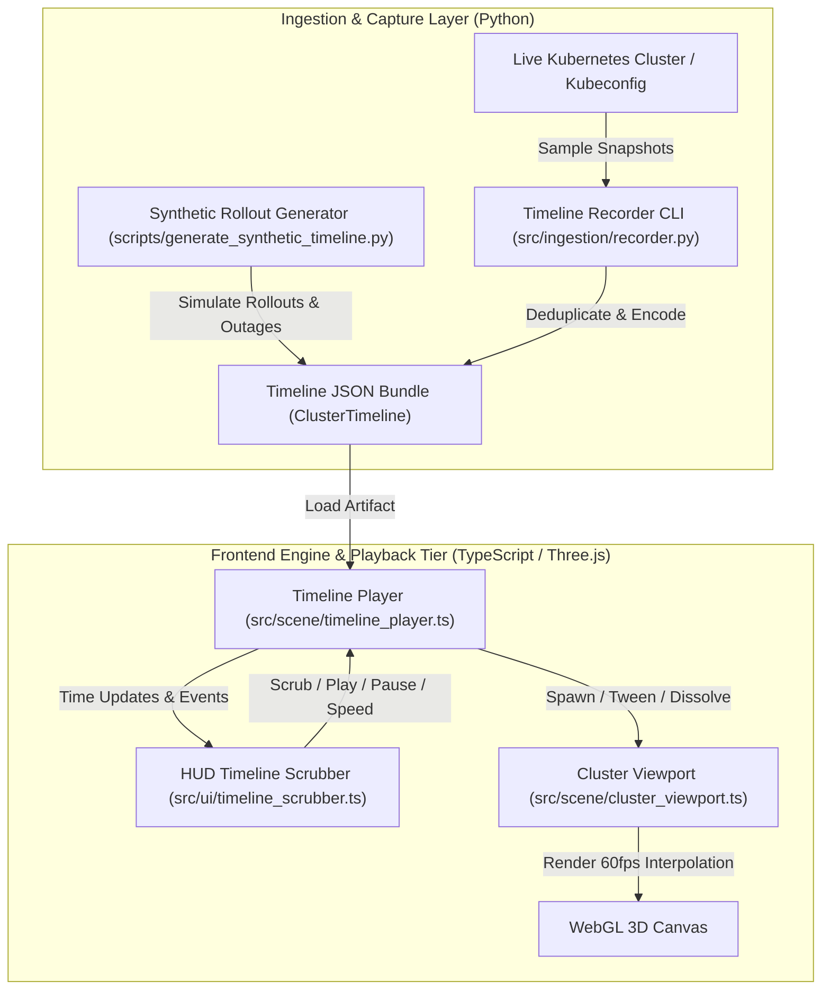

# Architectural Blueprint: SPEC-05 Time-Travel Cluster Topology Playback & Historical Scrubber Engine

**Status:** Approved  
**Author:** 🦉 Owl (Architectural Blueprint & Outer Loop Orchestrator)  
**Target:** `cluster-vis`  
**Reference:** `specs/05-time-travel-topology-scrubber.md`  

---

## 1. Executive Summary & Core Guarantees

SPEC-05 introduces chronological playback, historical time-travel scrubbing, and delta recording to `cluster-vis`. It enables infrastructure engineers and operators to record, scrub, and inspect cluster topology transformations across time (e.g. canary rollouts, autoscaling spikes, node drain events, and network partition degradations) in synchronized 3D WebGL space.

### 1.1 Invariants & Non-Breaking Principles
1. **Backward-Compatible Graph Schema:**  
   Each timeline keyframe embeds or references the canonical `ClusterGraph` schema from `src/ingestion/models.py`. Standard single-snapshot viewing remains completely unaffected.
2. **Deterministic Entity Tracking:**  
   Entities across time are identified using the composite deterministic key `namespace/kind/name` (with fallback to `id`). This guarantees smooth 3D spatial interpolation even if Kubernetes metadata generates new runtime pod UIDs during rolling updates.
3. **Delta Compression & Memory Efficiency:**  
   Timelines support both full keyframe checkpoints (e.g., every 5 minutes) and intermediate JSON delta frames ($\Delta_t = \text{State}_t - \text{State}_{t-1}$) to minimize JSON bundle sizes across long capture periods.
4. **Decoupled Playback State Machine:**  
   The UI scrubber controls (`src/ui/timeline_scrubber.ts`) interface with the 3D scene engine (`src/scene/timeline_player.ts`) via event callbacks and time offsets, allowing variable speed playback ($0.5\times, 1\times, 2\times, 5\times, 10\times$), looping, event jumping, and scrubbing without WebGL frame drops.

---

## 2. Time-Travel Architecture & Data Flow



---

## 3. Timeline Data Contracts (`src/ingestion/timeline_models.py`)

### 3.1 Pydantic Timeline Schema
```python
from typing import List, Optional, Literal, Dict, Any
from pydantic import BaseModel, Field
from src.ingestion.models import ClusterGraph

class TimelineEvent(BaseModel):
    timestamp: str
    event_type: Literal["pod_scheduled", "pod_evicted", "image_updated", "node_scaled", "config_drift"]
    summary: str
    affected_node_ids: List[str] = Field(default_factory=list)
    metadata: Dict[str, Any] = Field(default_factory=dict)

class ClusterTimelineKeyframe(BaseModel):
    timestamp: str
    snapshot_index: int
    graph: ClusterGraph
    events: List[TimelineEvent] = Field(default_factory=list)
    delta_summary: Optional[Dict[str, Any]] = None

class ClusterTimeline(BaseModel):
    cluster_name: str
    start_time: str
    end_time: str
    duration_seconds: float
    keyframes: List[ClusterTimelineKeyframe]
    metadata: Dict[str, Any] = Field(default_factory=dict)
```

---

## 4. 3D Spatial Tweening & State Transitions

When scrubbing or playing between keyframe $A$ ($t_A$) and keyframe $B$ ($t_B$):
1. **Persistent Nodes:** If a node exists in both frames with unchanged configuration, its position smoothly interpolates if spatial coordinates shift.
2. **Version Transitions:** When an image tag or semver changes between $t_A$ and $t_B$, the component material transitions to pulsing amber hazard brackets and updates the inspection diff card.
3. **Spawning Entities (Materialization):** Newly scheduled pods scale up smoothly ($0.1 \to 1.0$) with emerald particle cues.
4. **Evicted / Terminating Entities (Ghost Dissolve):** Removed components turn into red wireframe hollow ghosts ($opacity: 0.45 \to 0.0$, scale $1.0 \to 0.0$) over the transition duration before removal from the scene graph.

---

## 5. Architectural Decision Records (ADRs)

### ADR-CV-051: Deterministic Component Keys vs Ephemeral Kubernetes UIDs
- **Context:** Kubernetes generates distinct `metadata.uid` values on every pod recreate during rolling deployments.
- **Decision:** Track entities across timeline frames using `namespace/kind/name` (with workload owner affinity).
- **Rationale:** Preserves visual continuity during rolling updates so operators observe the deployment evolving in-place rather than erratic deletion/re-creation artifact flickers.

### ADR-CV-052: Dual-Mode Checkpoint Keyframes with Delta Compression
- **Context:** Storing full `ClusterGraph` models every second across hours of cluster telemetry leads to multi-megabyte JSON payloads.
- **Decision:** Author full keyframe snapshots at major intervals or significant topology shifts, while intermediate recording uses topological hash checks (SHA-256) to skip unchanged frames and attach discrete `TimelineEvent` records.
- **Rationale:** Ensures fast client-side scrubbing seeking with low memory overhead while preserving exact incident timelines.

### ADR-CV-053: Decoupled Scrubber HUD and Viewport State Machine
- **Context:** The timeline scrubber must support scrubbing both single-cluster and synchronized dual-cluster comparisons without tight coupling to Three.js render loops.
- **Decision:** Implement `TimelineScrubber` as a standalone DOM HUD component that communicates with `TimelinePlayer` via typed event callbacks (`onSeek`, `onPlayStateChange`, `onSpeedChange`).
- **Rationale:** Clean separation of concerns allows the timeline scrubber to control multiple viewports synchronously in dual-cluster diff mode.

---

## 6. 💡 Note to Future Self: Hosting Portability

1. **Static Timeline Storage (S3 / Cloudflare R2 / Local Static Storage):**
   - Timeline artifacts (`.json`) are self-contained, gzip-compressible static files. They can be stored in object storage buckets (S3, Cloudflare R2, MinIO) and loaded over standard HTTP GET with Range request support.
2. **Air-Gapped Incident Forensics:**
   - Incident response teams can export a single `incident-timeline.json` bundle during post-mortems and open it in an entirely offline `cluster-vis` browser instance without access to any live cluster or operator.
3. **Synchronous Dual-Cluster Comparative Playback:**
   - When comparing Staging vs Production timelines, both timelines can be loaded into separate `ClusterViewport` instances and driven by a single shared `TimelineScrubber` instance using normalized epoch timestamps.
