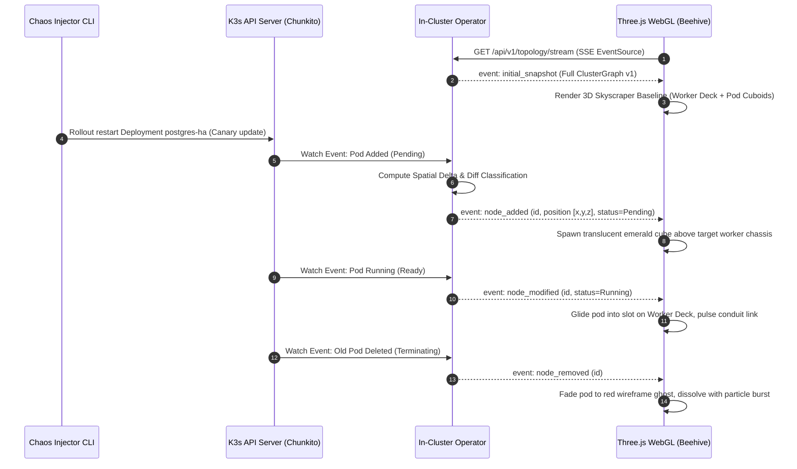

# Architectural Blueprint: SPEC-06 Ephemeral Multi-Cluster Testbed & Live Streaming Topology Matrix

**Status:** Proposed  
**Author:** 🦉 Owl (Architectural Blueprint & Outer Loop Orchestrator)  
**Target:** `cluster-vis`  
**Reference:** `specs/06-ephemeral-multi-cluster-testbed-and-live-streaming.md`  

---

## 1. System Overview & Component Event Flow

SPEC-06 connects the Three.js visualizer and In-Cluster Streaming Operator with real multi-node Kubernetes clusters hosted on `chunkito`, establishing an automated testbed harness for live streaming and multi-version fleet comparisons.

```mermaid
graph TD
    subgraph "Host: Beehive (100.99.188.15) — Development & Visualization"
        CLI["Testbed CLI: cluster-vis testbed (src/testbed/)"]
        Config["Declarative Fleet Spec (testbeds/fleet-spec.yaml)"]
        Config --> CLI
        
        WebGLClient["Three.js WebGL Client (:5180)"]
        GridController["Grid Viewport Controller (grid_controller.ts)"]
        WebGLClient --> GridController
        
        V1["Viewport 1: Stage-Alpha (v1.31)"]
        V2["Viewport 2: Prod-Beta (v1.32)"]
        V3["Viewport 3: Edge-Gamma (v1.33)"]
        GridController --> V1
        GridController --> V2
        GridController --> V3
    end

    subgraph "Tailscale Encrypted Mesh (100.x.x.x)"
        Tunnel["Tailscale Network Bridge"]
    end

    subgraph "Host: Chunkito (100.71.183.123) — Real Hardware Cluster Fleet"
        DockerDaemon["Docker Daemon (runc)"]
        CLI -->|SSH / Docker API Remote| DockerDaemon
        
        subgraph "Cluster 1: stage-alpha (K3d v1.31)"
            CP1["Control Plane (k3s-server) :64431"]
            W1["Worker Node 1 (k3s-agent)"]
            W2["Worker Node 2 (k3s-agent)"]
            Op1["Streaming Operator Pod :8081"]
        end
        
        subgraph "Cluster 2: prod-beta (K3d v1.32)"
            CP2["Control Plane (k3s-server) :64432"]
            W3["Worker Node 1 (k3s-agent)"]
            W4["Worker Node 2 (k3s-agent)"]
            W5["Worker Node 3 (k3s-agent)"]
            Op2["Streaming Operator Pod :8082"]
        end
        
        DockerDaemon --> Cluster 1
        DockerDaemon --> Cluster 2
        
        ResidentLLM["Resident Llama-Server (128GB Unified Memory: Jagular/Tigger)"]
    end

    Op1 -.->|SSE Stream :8081| Tunnel -.-> V1
    Op2 -.->|SSE Stream :8082| Tunnel -.-> V2
```

---

## 2. Hardware Resource & Network Blueprint

### 2.1 Isolation and Memory Budget on Chunkito
Chunkito features 128GB unified LPDDR5X memory shared between the CPU and AMD Radeon 8060S GPU. To guarantee zero disruption to large language models (`llama-server` holding ~100–108GB RAM):
- **Maximum Aggregate Memory Footprint for K3d Fleet:** $4.0\,\text{GB}$.
- **Node Cost Profile:** Each K3s container runs a stripped-down single-binary control plane and containerd instance requiring $\approx 80–120\,\text{MB}$ RSS.
- A 3-cluster fleet totaling 9 nodes consumes $\approx 1.0–1.2\,\text{GB}$ total RAM, leaving $>15\,\text{GB}$ buffer above the resident inference models.
- **CPU Isolation:** K3s containers remain throttled or default to background priority so prompt prefill / decode compute cycles are prioritized.

### 2.2 Tailscale Port Allocation Scheme
Every ephemeral cluster assigns predictable host port forwards on Chunkito:

| Cluster Identifier | Kubernetes Version | Kube-API Host Port | Operator SSE Port | Operator Snapshot Endpoint |
| :--- | :--- | :--- | :--- | :--- |
| `stage-alpha` | `v1.31.5-k3s1` | `64431` | `8081` | `http://100.71.183.123:8081/api/v1/topology/snapshot` |
| `prod-beta` | `v1.32.1-k3s1` | `64432` | `8082` | `http://100.71.183.123:8082/api/v1/topology/snapshot` |
| `edge-gamma` | `v1.33.0-rc1-k3s1` | `64433` | `8083` | `http://100.71.183.123:8083/api/v1/topology/snapshot` |

---

## 3. Data Flow & Delta Pipeline



---

## 4. Multi-Cluster Viewport Matrix Layouts

The frontend visualizer will support three distinct viewport layouts:

1. **Split-Screen Dual Viewport (Default):**
   - 2 side-by-side synchronized viewports.
   - Ideal for comparing `Cluster A` vs `Cluster B` (e.g. stage vs prod or v1.31 vs v1.32).
   - Diff engine overlays wireframe highlights and version skew flags.

2. **Quad Grid (2x2 Fleet Matrix):**
   - 4 synchronized miniature viewports.
   - Displays 4 clusters running distinct Kubernetes versions across the fleet.
   - Synchronized orbital camera: manipulating one rotates all four in unison.

3. **Single Focus (Temporal Deep-Dive):**
   - 1 full-screen viewport.
   - Dedicated right-side HUD event log and live SSE latency gauge.
   - Time-travel scrubber dock (SPEC-05) enabled to record and scrub backwards through live events.

---

## 5. Security & Isolation Invariants

1. **Read-Only In-Cluster RBAC:**
   The streaming operator deployed into the testbed clusters operates with strictly read-only permissions (`get`, `list`, `watch` on Pods, Nodes, Namespaces, CRDs).
2. **Secret Omission & Token Scrubbing:**
   Secret resources are never exported; ConfigMap contents are stripped of keys matching `password`, `token`, `key`, `cert`, or `secret`.
3. **Network Confinement:**
   Cluster internal container networks (`cni`) are contained inside Docker bridge networks and are never exposed publicly. API and Operator endpoints bind exclusively to Tailscale (`100.71.183.123`) or localhost.
