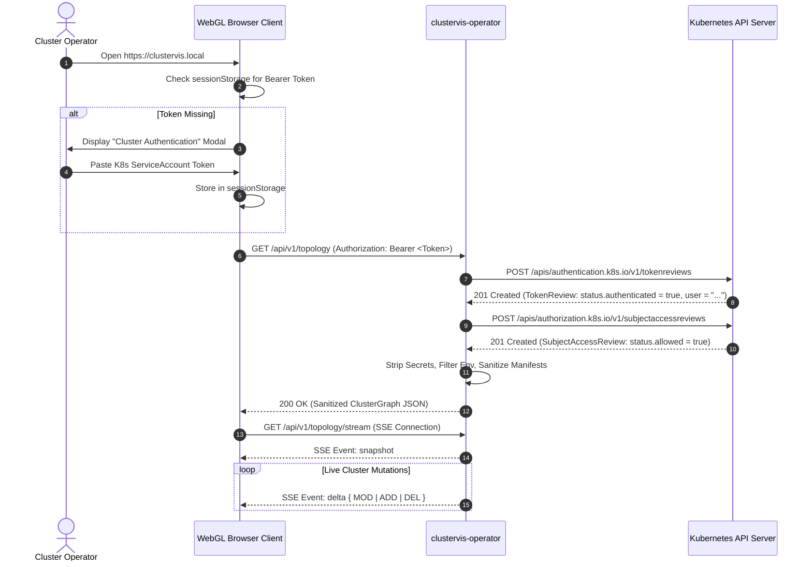

# Architectural Blueprint: SPEC-07 Portable In-Cluster Helm Packaging, Latency-Distance Topology & Federated Security

**Status:** Proposed  
**Author:** 🦉 Owl (Architectural Blueprint & Outer Loop Orchestrator)  
**Target:** `cluster-vis`  
**Reference:** `specs/07-portable-helm-packaging-and-latency-topology.md`  

---

## 1. System Overview & Component Event Flow

SPEC-07 evolves ClusterVis from an external ingestion and observation tool into a self-contained, cloud-native cluster application packaged via Helm. It introduces a physical **Latency-as-Distance** layout alongside the structural Skyscraper layout, with client-side multi-cluster federation and native Kubernetes authentication.

```mermaid
graph TD
    subgraph "Browser Client (Operator / Operator Hub)"
        UI["Three.js WebGL Application"]
        FederationMgr["Cluster Federation Manager (cluster_federation.ts)"]
        AuthModal["Token / OIDC Auth Dialog (auth_modal.ts)"]
        LayoutEngine["Dual-Mode Layout Controller (layout_transition.ts)"]
        
        UI --> FederationMgr
        UI --> LayoutEngine
        FederationMgr --> AuthModal
    end

    subgraph "Kubernetes Cluster A (Target 1: Helm Release 'clustervis')"
        IngressA["Ingress / NodePort :30080"]
        
        subgraph "clustervis-system Namespace (Cluster A)"
            OpA["clustervis-operator Pod"]
            K8sAPI_A["Kubernetes API Server"]
            ProbeA["clustervis-probe DaemonSet (1 per Node)"]
            
            OpA -->|Watch Informers| K8sAPI_A
            OpA -->|TokenReview / SAR| K8sAPI_A
            ProbeA -->|TCP SYN Latency Matrix| OpA
        end
    end

    subgraph "Kubernetes Cluster B (Target 2: Helm Release 'clustervis')"
        IngressB["Ingress / NodePort :30081"]
        
        subgraph "clustervis-system Namespace (Cluster B)"
            OpB["clustervis-operator Pod"]
            K8sAPI_B["Kubernetes API Server"]
            ProbeB["clustervis-probe DaemonSet (1 per Node)"]
            
            OpB -->|Watch Informers| K8sAPI_B
            OpB -->|TokenReview / SAR| K8sAPI_B
            ProbeB -->|TCP SYN Latency Matrix| OpB
        end
    end

    FederationMgr -->|HTTPS / SSE Stream A (Token A)| IngressA
    IngressA --> OpA
    
    FederationMgr -->|HTTPS / SSE Stream B (Token B)| IngressB
    IngressB --> OpB
```

---

## 2. Structural Layer Interfaces & Contracts

### 2.1 Latency-Distance Mathematical Physics Pipeline

The transition between architectural skyscraper coordinates and force-directed latency coordinates is managed by an in-memory relaxation engine:

```
[ K8s Informers (Pods, Services, Nodes) ]
                 │
                 ▼
[ Topological Graph Construction (Directed Multigraph) ]
                 │
                 ├── 1. Structural Layering Engine
                 │      Assigns Skyscraper Tiers (Y=0.5 to 12.0)
                 │      -> P_arch(x, y, z)
                 │
                 └── 2. Latency Force-Directed Embedder
                        Edge Rest Length: L0 = Lmin + S * log10(1 + latency / tau)
                        Edge Stiffness: K = Kbase * (1 + log10(1 + RPS))
                        Spring-Mass Relaxation (Fruchterman-Reingold / MDS)
                        -> P_latency(x, y, z)
                 │
                 ▼
[ Dual-Coordinate JSON Payload / SSE Stream ]
                 │
                 ▼
[ Three.js Viewport: Dynamic Lerp P(t) = (1 - a)*P_arch + a*P_latency ]
```

### 2.2 Security & Authentication Sequence



---

## 3. Performance & Rendering Budgets

| Subsystem | Target Metric | Architectural Control |
| :--- | :--- | :--- |
| **In-Cluster Operator RAM** | $\le 80\text{MB}$ RSS | In-memory graph using lightweight Python dicts/slots; no JVM or heavy external DB |
| **Probe DaemonSet RAM** | $\le 15\text{MB}$ RSS per node | Compiled static Go/Rust binary in scratch container; zero cgo |
| **Probe Network Traffic** | $< 15\text{KB/s}$ per node | Strict round-robin probe ceiling (max 20 peer targets per 3-second cycle) |
| **Graph Edge Explosion** | $O(\text{Services})$ rather than $O(\text{Pods}^2)$ | Hierarchical service-level conduit aggregation; idle micro-edge pruning |
| **Client Render Frame Rate** | $\ge 60\text{ FPS}$ sustained | Three.js `InstancedMesh` for cuboids; GPU vertex-shader particle streams |
| **Initial WebGL Load Time** | $< 1.5\text{ seconds}$ | Gzip-compressed Three.js bundle served directly from operator memory |

---

## 4. Architectural Decision Records (ADRs)

### ADR-01: In-Cluster Embedded Graph vs. External Graph Database (Neo4j)
- **Context:** Storing cluster topology as a graph enables blast-radius queries, shortest-path tracing, and distance calculations. A standalone Neo4j database requires 800MB–1.5GB RAM and a dedicated PersistentVolumeClaim per cluster.
- **Decision:** Reject in-cluster Neo4j deployment for standard packaging. Embed graph operations directly in the operator using Python NetworkX / in-memory adjacency structures, with embedded Kùzu as an optional persistent local graph engine.
- **Consequences:** Reduces chart footprint by $>90\%$, enables deployment on resource-constrained homelab nodes and K3d sandboxes, and eliminates persistent storage prerequisites.

### ADR-02: Zero-Dependency Synthetic TCP Probe vs. Mandatory Prometheus/Service Mesh
- **Context:** To visualize latency as physical distance, edge metrics must be acquired. Vanilla clusters (Kind, K3d) do not ship with Prometheus, Istio, or Cilium by default.
- **Decision:** Bundle an optional, microscopic synthetic probe DaemonSet (`clustervis-probe`) that performs unprivileged TCP SYN/connect measurements across nodes and service ports out of the box, with automated fallback detection for Prometheus and Cilium Hubble.
- **Consequences:** Guarantees that `helm install clustervis` immediately visualizes live latency on any cluster without requiring a pre-existing observability stack.

### ADR-03: Dual-Mode Coordinate Lerping vs. Force-Directed Layout Replacement
- **Context:** Force-directed layouts intuitively show latency clusters but can collapse into disorganized "hairballs," losing the clear mental model of control-plane tiers and worker decks.
- **Decision:** Retain the Skyscraper architecture (SPEC-02/03) as the default ground truth. Compute both Skyscraper coordinates and Latency Force coordinates, allowing the user to smoothly interpolate ($\alpha \in [0, 1]$) between them via a HUD slider.
- **Consequences:** Complete preservation of all existing visualizer milestones and documentation, while introducing the dynamic latency physics model as an additive capability.

---

## 5. 💡 Note to Future Self: Hosting Portability

### Cloud vs. Edge Decoupling
1. **Zero External Ingress Assumption:**
   - In production cloud environments (EKS, GKE, AKS), an Ingress controller with external DNS and OAuth2 / OIDC proxy (e.g., Cloudflare Access, AWS ALB, Google Cloud Armor) fronts the visualizer.
   - In edge, homelab, and air-gapped testbeds (K3d, Kind, bare-metal nodes across Tailscale), the operator functions autonomously without Ingress, relying on NodePort (`:30080`), port-forwarding, or direct Tailscale IP routing.
2. **Pluggable Identity & Auth Isolation:**
   - Client authentication relies on standard Kubernetes API primitives (`TokenReview` and `SubjectAccessReview`). This ensures zero vendor lock-in to external IdPs while maintaining enterprise compliance.
   - When running in ephemeral sandboxes or local dev clusters, disabling authentication (`auth.type: "none"`) requires only a single Helm flag (`--set auth.type=none`).
3. **Telemetry Portability & Degradation Strategy:**
   - The probe layer cleanly decouples metric sourcing:
     - Tier 1 (Self-Contained): `clustervis-probe` unprivileged TCP SYN measurement operates on raw Linux sockets without eBPF privileges.
     - Tier 2 (Observed Cloud): Cilium Hubble Relay gRPC connector transparently activates when present.
     - Tier 3 (Metrics Platform): Prometheus PromQL query connector provides historical percentile integration.
   - If telemetry fails completely, the engine gracefully falls back to synthetic estimated LAN latencies based on node locality topologies, preventing WebGL layout breakdown.

