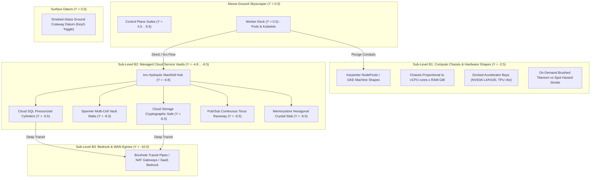

# Architectural Blueprint: SPEC-08 Subterranean Strata — Hardware Shapes, Karpenter Compute Classes & Managed Cloud Vaults

**Status:** Proposed  
**Author:** 🦉 Owl (Architectural Blueprint & Outer Loop Orchestrator)  
**Target:** `cluster-vis`  
**Reference:** `specs/08-subterranean-dependencies-and-compute-classes.md`  
**Extends:** `docs/architecture/01-architectural-skyscraper-topology.md`, `docs/architecture/02-layered-rectangular-architecture.md`, `docs/architecture/03-horizontal-node-peers-and-diff-engine.md`, `docs/architecture/07-portable-helm-packaging-and-latency-topology.md`  

---

## 1. Subterranean Spatial Topology & System Overview

SPEC-08 extends the highrise building metaphor downward into the subterranean foundation tiers ($Y \le 0.0$). Workloads on the Worker Deck ($Y = 0.5$) depend on physical machine shapes, modular accelerator hardware bays, declarative managed cloud resources (GCP KCC / kro), and deep transit egress.



---

## 2. Elevation Matrix & Layout Equations

### 2.1 Elevation Constants (`src/ingestion/layout.py`)

```python
ELEVATION_TIERS: Dict[str, float] = {
    # Above-Ground Tiers
    "client": 12.0,
    "aggregation": 9.5,
    "apiserver": 7.0,
    "vault": 5.5,
    "supervisor": 4.5,
    "framework": 2.5,
    "worker_deck": 0.5,

    # Subterranean Strata Tiers (SPEC-08)
    "surface_datum": 0.0,       # Ground reference plane / cutaway glass
    "compute_chassis": -2.5,    # Sub-Level B1: Karpenter / GKE Machine Shapes
    "kro_manifold": -4.8,       # Sub-Level B2 Upper: kro composition routing hub
    "cloud_vault": -6.5,        # Sub-Level B2 Lower: KCC / ACK managed services
    "bedrock_egress": -10.5,    # Sub-Level B3: External SaaS, WAN, NAT gateways
}
```

### 2.2 Proportional Chassis Sizing Formulation

$$\text{Chassis Width } (X) = \text{clamp}\left(3.2 + 0.35 \times \sqrt{\text{vCPU}}, \ 3.2, \ 8.0\right)$$
$$\text{Chassis Depth } (Z) = \text{clamp}\left(2.4 + 0.30 \times \sqrt{\text{RAM GiB}}, \ 2.4, \ 7.5\right)$$
$$\text{Chassis Height } (Y) = 0.6$$

---

## 3. Data Contracts & Interfaces (`src/ingestion/models.py`)

```python
from enum import Enum
from typing import Optional, List, Dict, Literal
from pydantic import BaseModel, Field

class CloudProvider(str, Enum):
    GCP = "gcp"
    AWS = "aws"
    AZURE = "azure"
    GENERIC = "generic"

class ManagedServiceCategory(str, Enum):
    DATABASE_RELATIONAL = "database_relational"     # CloudSQL, Spanner <-> RDS, Aurora
    DATABASE_NOSQL = "database_nosql"               # Firestore, Bigtable <-> DynamoDB
    OBJECT_STORAGE = "object_storage"               # GCS <-> S3
    MESSAGING_EVENTING = "messaging_eventing"       # Pub/Sub <-> SQS, SNS, Kinesis
    CACHE_IN_MEMORY = "cache_in_memory"             # Memorystore <-> ElastiCache
    SECURITY_SECRET = "security_secret"             # Secret Manager <-> SecretsManager
    NETWORKING_GATEWAY = "networking_gateway"       # Cloud NAT, Interconnect <-> NAT GW

class RemoteServiceResource(BaseModel):
    id: str
    provider: CloudProvider = CloudProvider.GCP
    category: ManagedServiceCategory
    cr_group: str
    cr_kind: str
    name: str
    namespace: str = "default"
    display_name: str
    status_phase: str = "Ready"                     # Ready, Reconciling, Degraded, Failed
    endpoint: Optional[str] = None
    vpc_network: Optional[str] = None
    managed_by: str = "kcc"                         # kcc, kro, ack, crossplane
    kro_parent_id: Optional[str] = None
    spatial: Optional[Dict[str, float]] = None

class MachineShape(BaseModel):
    node_name: str
    provider: CloudProvider = CloudProvider.GCP
    instance_type: str
    compute_class: Optional[str] = None             # GKE Compute Class / Karpenter NodePool
    vcpus: int = 4
    memory_gib: float = 16.0
    capacity_type: Literal["spot", "on-demand"] = "on-demand"
    zone: str = "us-central1-a"
    accelerator_type: Optional[str] = None          # nvidia-l4, tpu-v5e, etc.
    accelerator_count: int = 0
    chassis_width: float = 3.9
    chassis_depth: float = 3.6
```

---

## 4. Architectural Decision Records (ADRs)

### ADR-01: Vendor-Agnostic Remote Service Abstraction (GCP First, AWS Ready)
- **Context:** Initial implementation focuses on Google Cloud Config Connector (KCC) and `kro`. Future iterations require seamless integration with AWS Controllers for Kubernetes (ACK) and Crossplane.
- **Decision:** Normalize all external managed infrastructure into `RemoteServiceResource` with categorized taxonomy (`ManagedServiceCategory`). Concrete CRD watchers in `src/operator/controller.py` map native CRDs to this unified representation.
- **Consequences:** Three.js procedural vault generators (`src/scene/subterranean_vaults.ts`) depend exclusively on `ManagedServiceCategory`, requiring zero changes when AWS/Azure providers are introduced.

### ADR-02: Subterranean Vertical Plunges vs Horizontal Graph Sprawl
- **Context:** External services placed on the horizontal plane clutter cluster topology and obscure the skyscraper hierarchy.
- **Decision:** Route all managed service dependencies downward through vertical Bezier plunge conduits into Sub-Levels B1–B3 ($Y \le 0.0$).
- **Consequences:** Preserves clean skyscraper silhouette above ground while visually reinforcing foundational infrastructure dependencies below ground.

### ADR-03: Real-Time Latency & Degradation Shader Mechanics
- **Context:** Operators need instantaneous visual indication of remote service degradation or connectivity timeouts.
- **Decision:** Plunge conduits render dynamic Bezier curves with speed/color mapped to RTT ($<3\text{ms}$ cyan, $3-20\text{ms}$ amber, $>60\text{ms}$ magenta). Fracturing shaders and hazard strobe cones trigger when status is `Degraded` or `Failed`.
- **Consequences:** Provides immediate visual diagnostics without requiring separate telemetry dashboard drilldowns.

---

## 5. 💡 Note to Future Self: Hosting Portability

### Cloud vs. Edge Decoupling
1. **Air-Gapped & Ephemeral Clusters (Local / Bare-Metal / K3d):**
   - When running on local hardware (e.g. Chunkito K3d or Ser8 Kind), the operator detects the absence of KCC/kro CRDs and safely operates in degraded/mock mode without crashes.
   - Synthetic fixtures (`tests/fixtures/gcp_subterranean_manifests.yaml`) provide full visual verification in offline environments.
2. **Multi-Cloud Vendor Portability:**
   - The visual abstraction layer maps `ManagedServiceCategory.DATABASE_RELATIONAL` identically for GCP `SQLInstance` and AWS `DBInstance`.
   - Adding a new provider requires only a new CRD mapping dictionary in `src/operator/kcc_mapper.py` without frontend modifications.
3. **Ground Datum Cutaway Interactivity:**
   - In dense production views, the opaque ground datum ($Y = 0.0$) keeps the focus on pod workloads. The X-ray toggle (`KeyG`) gives operators on-demand foundation inspection.
