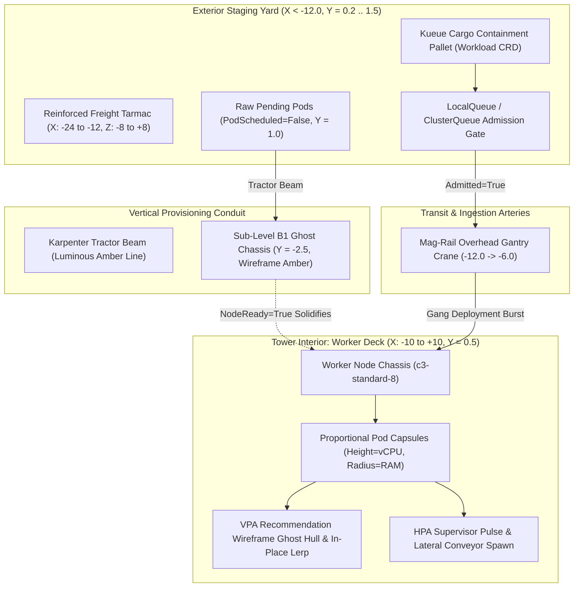

# Architectural Blueprint: SPEC-09 Workload Lifecycle — Proportional Pod Sizing, VPA/HPA Morphing & Pre-Admission Staging Yard (Kueue Gang Scheduling)

**Status:** Proposed  
**Author:** 🦉 Owl (Architectural Blueprint & Outer Loop Orchestrator)  
**Target:** `cluster-vis`  
**Reference:** `specs/09-pod-autoscaling-morphing-and-kueue-staging.md`  
**Extends:** `docs/architecture/01-architectural-skyscraper-topology.md`, `docs/architecture/02-layered-rectangular-architecture.md`, `docs/architecture/03-horizontal-node-peers-and-diff-engine.md`, `docs/architecture/08-subterranean-dependencies-and-compute-classes.md`  

---

## 1. Spatial Topology & Workload Lifecycle Overview

SPEC-09 breaks the static paradigm where all pods are identical cuboids on the Worker Deck ($Y = 0.5$). Instead, pods exhibit physical dimensionality proportional to their CPU and Memory requests, morph in-place during Vertical Pod Autoscaling (VPA), duplicate laterally during Horizontal Pod Autoscaling (HPA), and stage outside the skyscraper ($X < -12.0$) in an industrialized pre-admission freight yard when pending or gang-scheduled under Kueue.



---

## 2. Spatial Floorplan & Elevation Matrix

### 2.1 Coordinate Domains

| Zone | X Domain | Y Domain | Z Domain | Description |
| :--- | :--- | :--- | :--- | :--- |
| **Pre-Admission Tarmac** | $[-24.0, -12.0]$ | $0.20$ | $[-8.0, +8.0]$ | Industrial staging tarmac with illuminated edge beacons. |
| **Pending Pod Hover** | $[-22.0, -14.0]$ | $1.00$ | $[-6.0, +6.0]$ | Unscheduled pods suspended in low anti-gravity hover. |
| **Kueue Freight Pallet** | $[-21.0, -15.0]$ | $0.40 .. 1.80$ | $[-6.0, +6.0]$ | Modular cargo containment frame enclosing gang pods. |
| **Mag-Rail Intake** | $[-12.0, -8.0]$ | $1.20 .. 0.50$ | $0.00$ | High-speed cargo conveyor delivering admitted workloads. |
| **Worker Deck (Inside)**| $[-10.0, +10.0]$ | $0.50$ | $[-4.0, +4.0]$ | Physical node trays housing running proportional capsules. |
| **B1 Ghost Chassis** | $[-10.0, +10.0]$ | $-2.50$ | $[-4.0, +4.0]$ | Wireframe compute chassis awaiting cloud node provisioning. |

### 2.2 Mathematical Scaling Formulae

Pod dimensions are computed dynamically via continuous functions mapped from resource requests:

$$\text{Pod Height } (Y) = \text{clamp}\left(0.40 + 0.35 \times \sqrt{\text{vCPU Request}}, \ 0.40, \ 2.60\right)$$
$$\text{Pod Radius } (R) = \text{clamp}\left(0.20 + 0.12 \times \log_2(\max(1, \ \text{Memory GiB Request})), \ 0.20, \ 0.90\right)$$

- **Sidecar Proxy (10m CPU, 32MiB):** $H = 0.435$, $R = 0.200$ (compact needle).
- **Standard Service (500m CPU, 2GiB):** $H = 0.647$, $R = 0.320$ (balanced capsule).
- **In-Memory Cache (500m CPU, 32GiB):** $H = 0.647$, $R = 0.800$ (wide canister).
- **Distributed ML Worker (8 cores, 32GiB):** $H = 1.390$, $R = 0.800$ (commanding cylinder).

---

## 3. Data Contracts & Interfaces (`src/ingestion/models.py`)

### 3.1 Pydantic Model Extensions

```python
from enum import Enum
from typing import Optional, List, Dict, Any, Literal
from pydantic import BaseModel, Field

class AutoscalingStatus(BaseModel):
    """Autoscaling metadata for VPA and HPA tracking (SPEC-09 §6)."""
    has_vpa: bool = False
    vpa_target_cpu: Optional[str] = None
    vpa_target_memory: Optional[str] = None
    is_resizing_in_place: bool = False
    
    has_hpa: bool = False
    current_replicas: int = 1
    desired_replicas: int = 1
    target_metric: Optional[str] = None

class KueueWorkloadStatus(BaseModel):
    """Atomic gang workload tracking under Kueue (SPEC-09 §6)."""
    workload_uid: str
    workload_name: str
    namespace: str = "default"
    local_queue: str
    cluster_queue: str
    is_admitted: bool = False
    admission_checks: List[Dict[str, str]] = Field(default_factory=list)
    pod_uids: List[str] = Field(default_factory=list)
    total_cpu_requested: float = 0.0
    total_memory_gib_requested: float = 0.0
    total_gpu_requested: int = 0
    phase: Literal["Inadmissible", "Admissible", "Admitted", "Finished"] = "Admissible"

class PodGeometrySpec(BaseModel):
    """Proportional capsule dimensions and staging assignments (SPEC-09 §6)."""
    height: float = 0.6
    radius: float = 0.3
    color_tint: str = "#4FC3F7"
    is_pending: bool = False
    staging_track_x: Optional[float] = None
    karpenter_target_node_claim: Optional[str] = None
```

---

## 4. Architectural Decision Records (ADRs)

### ADR-01: Procedural Capsule Geometry vs. Pre-Baked GLB Clones
- **Context:** Previously, pods were cloned from a static Blender `Cuboid_Pod` prototype. Cloned meshes cannot dynamically scale radius and height independently without distorting bevel corners and UV mapping.
- **Decision:** Generate procedural `THREE.CapsuleGeometry(radius, height - 2*radius, 16, 16)` dynamically per pod in `src/scene/pod_capsules.ts`. Share materials via a material cache indexed by container status and diff color.
- **Consequences:** Eliminates distortion of rounded ends. Enables seamless per-vertex or scale-factor interpolation during VPA in-place resizes.

### ADR-02: Pre-Admission Staging Tarmac & Karpenter Tractor Beams
- **Context:** Unscheduled or pending pods (`PodScheduled=False`) previously either vanished from the scene or were placed arbitrarily at $(0, 0, 0)$, cluttering the origin.
- **Decision:** Reserve spatial zone $X \in [-24.0, -12.0]$ at $Y = 0.2$ as an external freight tarmac. Pending pods hover at $Y = 1.0$. When Karpenter provisions a `NodeClaim`, an amber vertical tractor beam links the pending pod cluster to a wireframe "Ghost Node" chassis on Sub-Level B1 ($Y = -2.5$).
- **Consequences:** Makes scheduling latency and compute provisioning delays immediately visible as spatial phenomena before pods enter the tower.

### ADR-03: Unified Cargo Containment Pallet for Kueue Gangs
- **Context:** Distributed AI/ML jobs (Ray, PyTorch, MPI) admitted via Kueue enter or stall as a unified gang. Treating 32 pods as individual pending items produces visual clutter.
- **Decision:** Bundle pods associated with a Kueue `Workload` CRD into a procedural wireframe bounding pallet (`KueueCargoPallet`) with floating HUD telemetry (Queue name, Pod count, Quota). When `is_admitted=True`, the entire pallet glides along a mag-rail intake axis into the building and unlatches into constituent capsules on the Worker Deck.
- **Consequences:** Accurately reflects batch scheduling semantics in high-performance AI clusters.

---

## 5. 💡 Note to Future Self: Hosting Portability

- **Zero-Dependency Fallbacks:** In clusters without VPA, HPA, or Kueue installed, the ingestion pipeline safely defaults `AutoscalingStatus` and `KueueWorkloadStatus` to absent. Pods without explicit requests fall back to default dimensions ($H = 0.60, R = 0.30$).
- **Client Performance:** Capsule geometries are low-poly ($16 \times 16$ segments). In clusters with $> 500$ pods, `InstancedMesh` with transformation matrices encoding proportional scale ($S_x = R, S_y = H, S_z = R$) can be utilized to sustain 60 FPS on edge browser clients.
