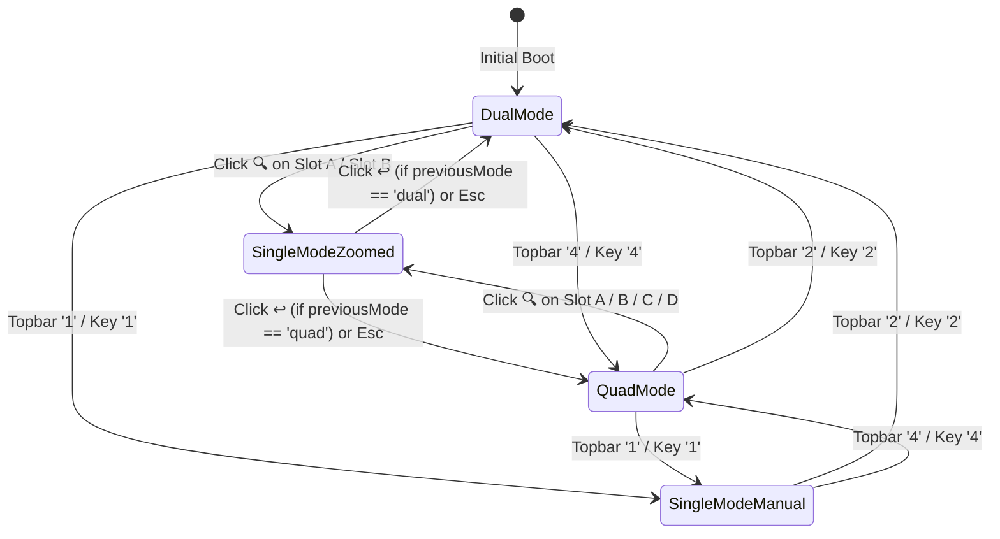

# Architectural Blueprint: SPEC-12 Viewport Pane Zoom-In Focus and Previous View Restoration

**Document Reference:** `docs/architecture/12-viewport-pane-zoom-and-restore.md`  
**Companion Specification:** `specs/12-viewport-pane-zoom-and-restore.md`  
**Target System:** `cluster-vis`  
**Status:** Approved Architecture Blueprint  
**Author:** 🦉 Owl (Architectural Synthesizer & Swarm Orchestrator)  
**Date:** 2026-10-07  

---

## 1. High-Level Architecture & Interaction Topography



---

## 2. Component Design & Functional Contracts

### 2.1 GridController State Machine (`src/scene/grid_controller.ts`)

`GridController` manages layout geometry, orbit camera synchronization, and active viewport slots.

```typescript
export interface ViewportSlot {
  id: string;
  viewport: ClusterViewport;
  container: HTMLElement;
  title: string;
  clusterName: string;
  k8sVersion?: string;
  channel?: string;
  streamUrl?: string;
  zoomButton?: HTMLButtonElement;
}

export interface GridControllerOptions {
  wrapperElement: HTMLElement;
  hudContainer?: HTMLElement | null;
  onModeChange?: (mode: GridMode) => void;
  onZoomChange?: (isZoomed: boolean, focusedSlotId: string, previousMode: GridMode | null) => void;
}
```

#### New Class Properties:
* `private focusedSlotId: string = 'a';`
* `private previousMode: GridMode | null = null;`
* `private isZoomed: boolean = false;`
* `private onZoomChangeCb?: (isZoomed: boolean, focusedSlotId: string, previousMode: GridMode | null) => void;`

#### Logic Specifications:
1. `zoomSlot(slotId: string)`:
   * Record `previousMode = (this.mode === 'single') ? (this.previousMode ?? 'dual') : this.mode;`
   * Set `focusedSlotId = slotId;`
   * Set `isZoomed = true;`
   * Call `this.setMode('single');`
   * Trigger `this.onZoomChangeCb?.(true, this.focusedSlotId, this.previousMode);`
   * Update all slot zoom buttons: set the focused slot button to exit icon (`↩`), and all others to zoom icon (`🔍`).
2. `restorePreviousMode()`:
   * Target mode = `this.previousMode ?? 'dual'`;
   * Set `isZoomed = false;`
   * Call `this.setMode(targetMode);`
   * Trigger `this.onZoomChangeCb?.(false, this.focusedSlotId, this.previousMode);`
   * Update all slot zoom buttons: return all to zoom icon (`🔍`).
3. `setMode(mode: GridMode)`:
   * If `mode !== 'single'`, reset `this.isZoomed = false;`
   * Update DOM styles via `applyGridStyles()`.
   * Trigger `onResize()` across all active viewports (`this.getActiveSlots()`).
   * Update Skew Matrix HUD.
   * Call `this.onModeChangeCb?.(mode);`
4. `applyGridStyles()` in Single Mode:
   * When `this.mode === 'single'`:
     - Hide `.viewport-divider` (`divider.style.display = 'none'`).
     - `#viewports-wrapper`: `display: block`.
     - For each `slot` in `this.slots`:
       - If `slot.id === this.focusedSlotId`: `display: 'block'`, `width: '100%'`, `height: '100%'`, `gridColumn: ''`, `gridRow: ''`.
       - Else: `display: 'none'`.

---

### 2.2 In-Pane Zoom & Restore Button Component (`src/scene/grid_controller.ts` & `index.html`)

To provide an integrated experience without cluttering the 3D canvas:
1. Each `.viewport-pane` receives a button element `.viewport-zoom-btn`:
   ```html
   <button class="viewport-zoom-btn" data-slot-id="${slot.id}" aria-label="Zoom pane">
     <svg class="zoom-icon" viewBox="0 0 24 24" width="16" height="16" fill="none" stroke="currentColor" stroke-width="2">
       <!-- Magnifying Glass Icon -->
       <circle cx="11" cy="11" r="8"></circle>
       <line x1="21" y1="21" x2="16.65" y2="16.65"></line>
     </svg>
   </button>
   ```
2. When zoomed in, the icon switches to:
   ```html
   <svg class="restore-icon" viewBox="0 0 24 24" width="16" height="16" fill="none" stroke="currentColor" stroke-width="2">
     <!-- Return / Exit Arrow Icon -->
     <polyline points="9 14 4 9 9 4"></polyline>
     <path d="M20 20v-7a4 4 0 0 0-4-4H4"></path>
   </svg>
   ```
3. Styling:
   ```css
   .viewport-zoom-btn {
     position: absolute;
     top: 12px;
     right: 14px;
     z-index: 50;
     background: rgba(17, 24, 39, 0.85);
     backdrop-filter: blur(8px);
     border: 1px solid var(--border-subtle);
     border-radius: 6px;
     color: var(--text-secondary);
     width: 32px;
     height: 32px;
     display: flex;
     align-items: center;
     justify-content: center;
     cursor: pointer;
     transition: all 0.15s ease;
   }
   .viewport-zoom-btn:hover {
     background: #1f2937;
     color: var(--accent-blue);
     border-color: var(--accent-blue);
     transform: scale(1.05);
   }
   ```

---

## 3. Architecture Decision Records (ADRs)

### ADR-01: In-Pane Button Placement vs Topbar-Only Selection
* **Context:** Should zoom controls live inside each viewport pane or in the topbar?
* **Decision:** Place contextual zoom buttons directly within each `.viewport-pane` in the upper-right corner.
* **Rationale:** In a 4-pane fleet matrix, the operator's gaze is focused on the target cluster. Clicking directly on that pane's corner provides spatial immediacy and minimizes visual travel.

### ADR-02: State Tracking via `previousMode`
* **Context:** When returning from a single-pane zoom, how does the system know whether to restore 2 panes or 4 panes?
* **Decision:** Track `previousMode: GridMode | null` inside `GridController`.
* **Rationale:** Preserves user intent across navigation actions without requiring external state stores. If user came from quad view, return to quad view; if from dual view, return to dual view.

### ADR-03: Keyboard Shortcuts (`Escape` and `KeyZ`)
* **Context:** Providing rapid keyboard navigation for power operators.
* **Decision:**
  - `Escape`: If in zoomed single mode, restores `previousMode`.
  - `1`, `2`, `4`: Maintain existing instant mode switches.
* **Rationale:** Conforms to universal full-screen / zoom keyboard expectations.

---

## 4. 💡 Note to Future Self: Hosting Portability

All viewport resizing, zoom state, and DOM mutations are 100% client-side and decoupled from in-cluster operator streams. Whether ClusterVis is deployed as a static Single-Page Application (SPA) on GitHub Pages, hosted via Tailscale on Chunkito, or bundled inside an air-gapped Helm chart on GKE/OpenShift, the zoom and restore functionality operates without backend dependencies.
