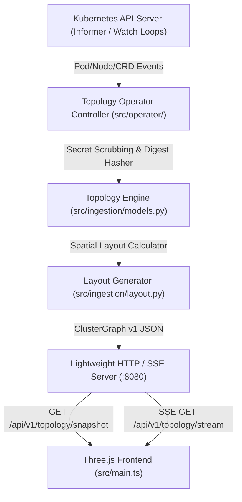

# SPEC-04: Optional In-Cluster Streaming Topology Operator & CRD (`clustervis.io/v1alpha1`)

**Status:** Proposed  
**Author:** Christopher Robin (Lead Architect) & 🦉 Owl (Architectural Synthesizer)  
**Date:** 2026-10-02  
**Target:** `cluster-vis`  
**Extends:** `specs/03-horizontal-node-peers-and-diff-engine.md`  

---

## 1. Executive Summary & Core Directives

SPEC-03 established the CLI-based universal cluster exporter (`python3 -m src.ingestion.exporter`). SPEC-04 defines an **optional, additive in-cluster mode** that allows Kubernetes clusters to stream real-time topology diffs and workload events directly into the Three.js visualizer over Server-Sent Events (SSE) or WebSockets without polling or rebuilding static JSON files.

### 1.1 Additive Non-Breaking Guarantee
- **Zero Impact on Static/CLI Workflows:** The visualizer frontend MUST continue to function 100% offline via static JSON bundles (`dist/data/*.json`, `public/data/*.json`) and CLI dumps (`cluster-vis dump`).
- **Opt-In Live Streaming Mode:** When a live operator endpoint is configured (e.g. via HUD dropdown, URL parameter `?stream=http://localhost:8080/api/v1/topology/stream`, or in-cluster proxy), the Three.js viewport connects seamlessly and animates node additions, deletions, and version skews live.
- **Zero Heavy In-Cluster Footprint:** The operator is deployed as a single lightweight Go or Python controller (`deployment/operator.yaml`) consuming $<50\text{MB}$ RAM with read-only cluster RBAC permissions.

---

## 2. In-Cluster CRD Contract: `clustervis.io/v1alpha1`

### 2.1 Custom Resource Definition (`ClusterTopologySnapshot`)
The operator publishes and reconciles `ClusterTopologySnapshot` custom resources:

```yaml
apiVersion: apiextensions.k8s.io/v1
kind: CustomResourceDefinition
metadata:
  name: clustertopologysnapshots.clustervis.io
spec:
  group: clustervis.io
  names:
    kind: ClusterTopologySnapshot
    listKind: ClusterTopologySnapshotList
    plural: clustertopologysnapshots
    singular: clustertopologysnapshot
    shortNames:
      - cts
  scope: Cluster
  versions:
    - name: v1alpha1
      served: true
      storage: true
      schema:
        openAPIV3Schema:
          type: object
          properties:
            spec:
              type: object
              properties:
                exportIntervalSeconds:
                  type: integer
                  default: 10
                excludedNamespaces:
                  type: array
                  items:
                    type: string
                scrubSecrets:
                  type: boolean
                  default: true
                trackImageDigests:
                  type: boolean
                  default: true
            status:
              type: object
              properties:
                lastSnapshotTimestamp:
                  type: string
                  format: date-time
                nodeCount:
                  type: integer
                podCount:
                  type: integer
                driftDetected:
                  type: boolean
                activeHash:
                  type: string
```

---

## 3. Streaming Operator Architecture



### 3.1 Streaming API Endpoints
The operator exposes a lightweight REST and Server-Sent Events (SSE) server on port `:8080`:

1. `GET /api/v1/healthz`  
   Returns `{ "status": "ok", "uptime_seconds": 1240 }`.

2. `GET /api/v1/topology/snapshot`  
   Returns full current `ClusterGraph` JSON identical to the schema produced by `exporter.py`.

3. `GET /api/v1/topology/stream` (SSE: `text/event-stream`)  
   Emits streaming topology mutation events:
   - `event: initial_snapshot` -> Full `ClusterGraph` JSON.
   - `event: node_added` -> `{ "node": <NodeComponent>, "timestamp": ... }`.
   - `event: node_removed` -> `{ "node_id": "...", "timestamp": ... }`.
   - `event: node_modified` -> `{ "node_id": "...", "diffDetails": [...], "status": "version_skew" }`.
   - `event: edge_updated` -> `{ "edges": [<DataFlowEdge>, ...] }`.
   - `event: heartbeat` -> Periodic ping every 15s to keep connection alive.

---

## 4. Frontend Client Integration (`src/scene/live_stream.ts`)

### 4.1 UI Controls
1. **Live Stream Indicator in HUD:**
   A topbar pill labeled `📡 LIVE STREAM` with status indicator (Green = Connected, Amber = Reconnecting, Gray = Offline/Static File Mode).
2. **Stream Source Selector:**
   Allows the user to paste an arbitrary cluster streaming endpoint URL or select from discovered contexts.
3. **Animated Mutation Handling:**
   - **New Pod Scheduled:** Newly added cuboid appears at $(X_i, Y=0.75, Z)$ with emerald entrance burst particle effect.
   - **Pod Terminated:** Component turns into red wireframe ghost for 3.0s before smoothly dissolving out.
   - **Pod Image/Config Drift:** Amber hazard stripes fade in and emit pulse effect on top chamfer edges.

---

## 5. Swarm Work Breakdown (Pantheon Tasks)

- **[TASK-CV-501]** [CRD & Manifests] Author `deploy/crd/clustervis.io_clustertopologysnapshots.yaml` and `deploy/operator/operator.yaml`.
- **[TASK-CV-502]** [Operator Controller] Author `src/operator/controller.py` with Kubernetes informer watch loops for Pods, Nodes, and CRDs.
- **[TASK-CV-503]** [Streaming Server] Build lightweight SSE HTTP server in `src/operator/server.py` exposing `/api/v1/topology/stream` and `/snapshot`.
- **[TASK-CV-504]** [Frontend Live Stream Client] Implement `src/scene/live_stream.ts` managing EventSource SSE connections and dispatching delta events to `ClusterViewport`.
- **[TASK-CV-505]** [Dynamic Delta Animations] Add real-time component spawn/dissolve transitions in `src/scene/cluster_viewport.ts`.
- **[TASK-CV-506]** [Tests & Offline Fallbacks] Author unit tests in `tests/test_operator_and_stream.py` ensuring static file mode is completely unimpaired when stream server is unreachable.
